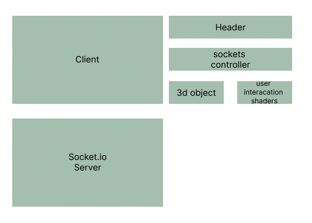

## Interactive Web Art Capstone

Megan Mckissack

## Description
An interactive web app to give users a fun experience and a connection to others, collaborating with strangers to create art.

## Technologies Used
- _socket.io_
- _react.js_
- _node.js_
- _express.js_
- _cors_
- _nodemon_
- _react-three-fiber_
- _webgl_
- _photogrammetry_
- 

## Setup/Installation Requirements
- using your terminal, clone or download this repository to your computer
- open files in your favorite text editor or IDE
- run the command `npm install` to install the necessary packages to run the program

## Known Bugs

_can't get pointer event coordinates to pass to leaf generator position_

## License

_MIT_

Copyright (c) _November 5, 2022_ _Megan McKissack_
